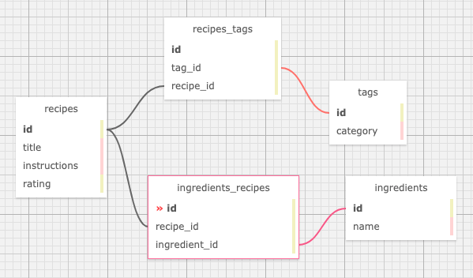

# Recipe Box
#### **Author: Andy Lawson, Jo Miller, Zack Rutledge**
* * *

## Description

This app lets people create recipes. Users may add, update, and delete recipes. They may also add any ingredients and instructions that belong to a recipe.

## Technologies used

* HTML
* Bootstrap
* git
* Ruby on Rails
* Embedded Ruby (ERB)
* RSpec
* Bundler
* PostgreSQL

* * *
## User Stories

* As a user, I want to add a recipe with ingredients and instructions, so I remember how to prepare my favorite dishes.
* As a user, I want to tag my recipes with different categories, so recipes are easier to find. A recipe can have many tags and a tag can have many recipes.
* As a user, I want to be able to update and delete tags, so I can have flexibility with how I categorize recipes.
* As a user, I want to edit my recipes, so I can make improvements or corrections to my recipes.
* As a user, I want to be able to delete recipes I don't like or use, so I don't have to see them as choices.
* As a user, I want to rate my recipes, so I know which ones are the best.
* As a user, I want to list my recipes by highest rated so I can see which ones I like the best.
* As a user, I want to see all recipes that use a certain ingredient, so I can more easily find recipes for the ingredients I have.

* * *
## Schema



* * *
## Software Requirements
* **Ruby is required to run this application**
* **PostgreSQL is required to run the database**

 <a href="https://www.learnhowtoprogram.com/ruby-and-rails/getting-started-with-ruby/installing-ruby">Ruby download instructions</a>
  <a href="https://www.learnhowtoprogram.com/ruby-and-rails/getting-started-with-ruby/installing-postgres">PosgreSQL download instructions</a>

## Installation Instructions
1. Navigate to the desired directory where you would like to clone the project to.

2. Once you have chosen your desired directory, clone the github repo using the version control tool `git` (<a href="https://www.learnhowtoprogram.com/introduction-to-programming/getting-started-with-intro-to-programming/git-and-github">download instructions</a>). Typing the following command into your terminal:
```bash
$ git clone https://github.com/andyL89/rails_recipe_box
```
3. Open the project in VSCode by typing the following in your terminal:

``` bash
$ code .
```
* Note: VSCode is a code editing software. If you don't already have it, you can download it <a href="https://code.visualstudio.com/">here</a>

4. While located in the root directy, install gem bundler by typing:

``` bash
$ gem install bundler
```

5. Install gem bundles by typing:

``` bash
$ bundle install
```

6. Create a database for this project by typing the following into your terminal while located in the root directory:
```
$ rake db:create
```

7. Add all tables to the database by typing the following in your terminal:
```
$ rake db:migrate
```

8. Mirror the migration database changes in the test database:
```
$ rake db:test:prepare
```

The database should now be correctly set up. And you may start a local server to interact with the project.

9. To start a local server, open your default browser and type "localhost:3000" into the search bar and press enter. Here, you will see the live server.

## Running Tests
* This application was created using test-driven development (TDD).
* To run the tests yourself, follow the steps below.

Simply type "rspec" into your terminal while located in the root directory of the project.
``` bash
$ rspec
```
* * *

## License
> [GPLv3](https://choosealicense.com/licenses/gpl-3.0/)\
> Andy Lawson &copy; 2021
> Jo Miller &copy; 2021
> Zack Rutledge &copy; 2021

* * *

## Contact Information

Reach Jo via <a href="https://www.linkedin.com/in/jomillerde/" target="_blank">Linkedin</a> or <a href="joannadawnmiller@gmail.com" target="_blank">email</a></li>.

Reach Andy via <a href="https://www.linkedin.com/in/andrew-lawson-dev/" target="_blank">Linkedin</a> or <a href="alawson89@gmail.com" target="_blank">email</a></li>.

Reach Zack via <a href="https://www.linkedin.com/in/zack-rutledge762/" target="_blank">Linkedin</a> or <a href="thorgrim88@gmail.com" target="_blank">email</a></li>.